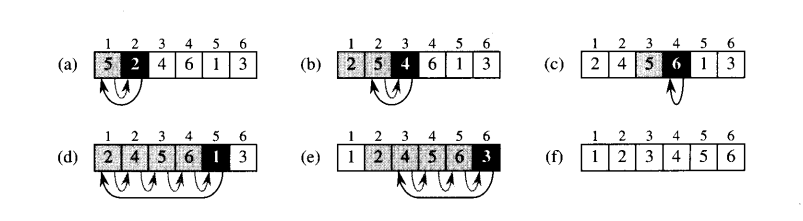
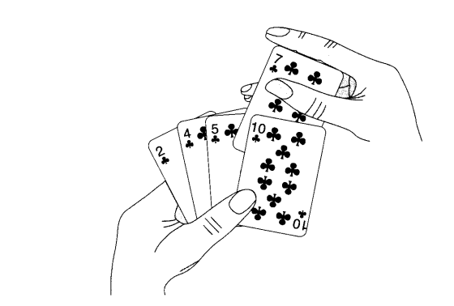

# Insert sort

## O algoritmo de insertion sort é comumente utilizado em situações em que se tem um número relativamente pequeno de elementos a serem ordenados. Isso se deve ao fato de que, em geral, ele tem um desempenho inferior a outros algoritmos de ordenação em situações de grande escala.



<hr>

### __Aqui estão alguns exemplos reais de situações em que o algoritmo de insertion sort pode ser usado__:
<br>


- __Ordenação de cartas em um baralho__: ao embaralhar um baralho de cartas, pode-se usar o insertion sort para colocar as cartas em ordem. Nesse caso, cada carta é comparada com a carta à sua esquerda, e as cartas são movidas de posição até que todas estejam em ordem.

    <div style="text-align: center;">
        
    </div>

- __Ordenação de nomes em uma lista telefônica__: se uma lista telefônica precisa ser ordenada por ordem alfabética, o insertion sort pode ser usado. Cada nome é comparado com o nome à sua esquerda, e os nomes são movidos de posição até que todos estejam em ordem alfabética.

- __Ordenação de pequenos conjuntos de dados em sistemas embarcados__: em sistemas embarcados com recursos limitados de processamento e memória, o insertion sort pode ser uma boa escolha para ordenar pequenos conjuntos de dados, como listas de configurações ou registros de dados.

- __Ordenação de dados em memória de curto prazo__: em alguns casos, o insertion sort pode ser mais eficiente do que outros algoritmos de ordenação em situações em que os dados precisam ser ordenados rapidamente em memória de curto prazo, como em algoritmos de processamento de dados em tempo real.

<hr>

<br>

## Visualização em pseudocódigo
<hr>

## __Sempre se inícia pelo segundo elemento, já que uma lista composta por apenas 1 elemento já está ordenada__.

### Lista = [90, 75, 88, 2, 0, 10]

### $i  = 1; -> indice inicial
### $tamLista = 6

### cópia: $lista[$i]
### indice: $i


### portugol código

<br>

```php
    inteiro lista[6] = [85, 12, 59, 45, 72, 51]
    inteiro copia, indice, i

    para(i = 1; i < tamLista; i ++){
        copia = lista[i]
           indice = i
    
           enquanto(indice > 0 e lista[indice - 1] > copia){
               lista[indice] = lista[indice - 1]
               indice--
           }
           lista[indice] = copia
    }

    imprimir(lista, 6)
```

### fluxograma sobre o que foi feito acima 

<hr>

